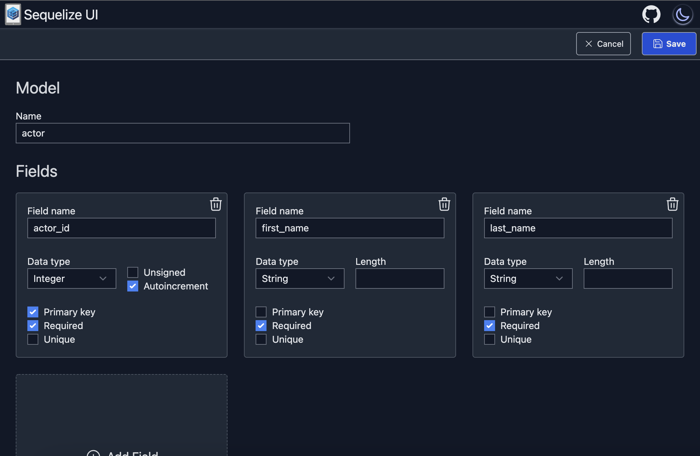

# Sequelize UI

https://sequelizeui.app/

Sequelize UI is a [Sequelize ORM](https://sequelize.org/) code generator, which generates a full Node.js TypeScript project, entirely in the browser. Use the schema editor to design your database tables, fields and associations, then preview the Sequelize models and migrations in the code viewer before downloading the project as a zip file or copying code from individual files.

You can customize the generated Sequelize code with the following database configurations:

- PostgreSQL, MySQL, MariaDB, SQLite or Microsoft SQL Server dialects.
- Singular or plural table names
- camelCase or snake_case table and column names.
- Table name prefixed primary keys or plain id primary keys.
- Created/updated timestamps or no timestamps.

 

## Usage

To use Sequelize UI, either go to https://sequelizeui.app or run the project locally with:

```sh
npm ci
npm run build
npm npx serve@latest out
```

Then go to http://localhost:3000

### Plain JavaScript

Sequelize UI currenly only generates TypeScript Sequelize code, however, an older version is still available at https://js.sequelizeui.app/ which generates plain JavaScript Sequelize code. Future support for JavaScript is planned and can be tracked in [tasks.md](./tasks.md).
