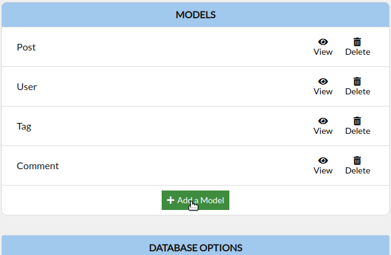
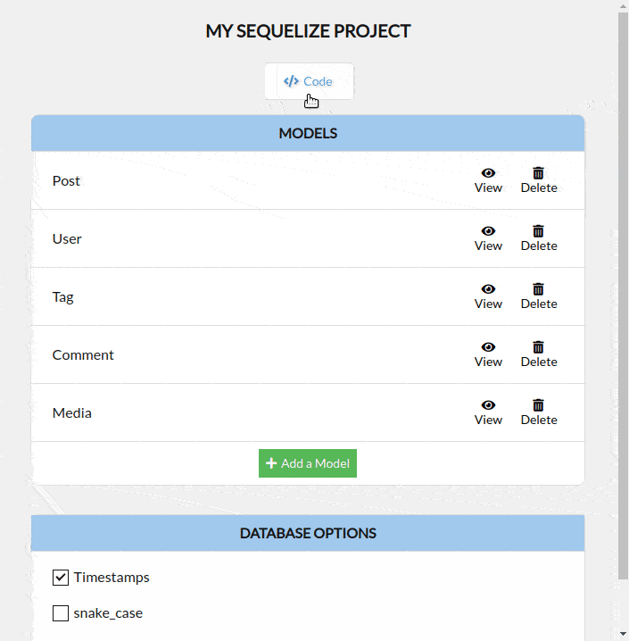
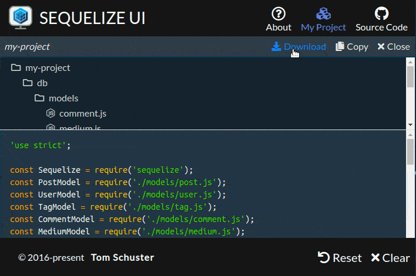

# sequelize-ui
[](https://travis-ci.com/tomjschuster/sequelize-ui)

## About

[**Sequelize UI**](https://sequelizeui.app) provides a user-friendly interface for designing a relational database and generating [Sequelize ORM](https://sequelize.org/) model code for a Node.js project.



Use the code previewer to see the generated Sequelize code for your models, including configuration such as table/column name casing and pluralization.



Download your generated Sequelize project, and run it immediately.



## Using Sequelize UI

You can use Sequelize UI at [sequelizeui.app](https://sequelizeui.app) or you can run it locally:


```
git clone https://github.com/tomjschuster/sequelize-ui.git
cd sequelize-ui
npm install
npm start
```

## Future enhancements
- Multiple Projects
- Select Driver
- Migrations
- Sequelize v5 templates
- Generate code for multiple frameworks

